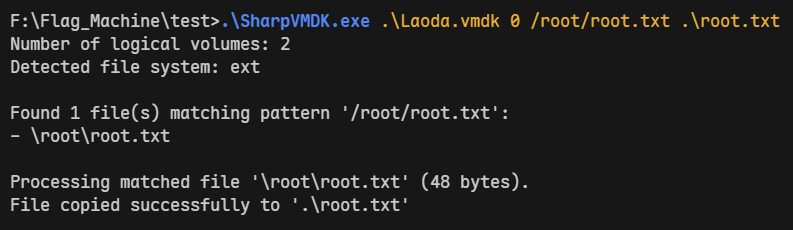
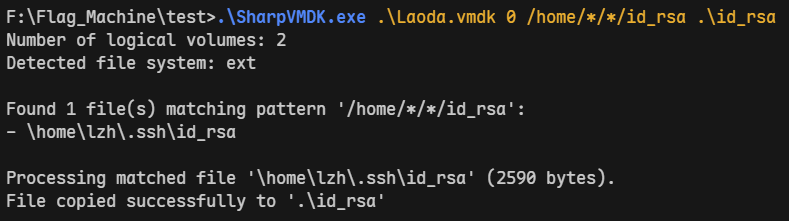
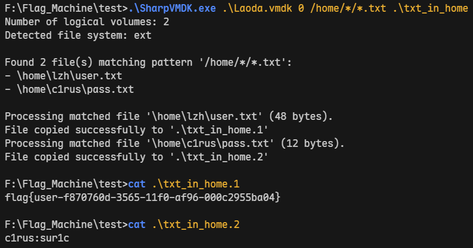

## SharpVMDK

SharpVMDK is a simple VMDK processing tool based on C# and dotNET. It provides a simple way to directly access specified files inside the VMDK and supports fuzzy searching of files using wildcards. This is useful for simple forensics.

## Some cases

A few simple examples are enough to show you how SharpVMDK is used.

- Get a specified file
  
  
- Fuzzy matching paths
  

- Fuzzy matching names
  

## References

- https://github.com/DiscUtils/DiscUtils